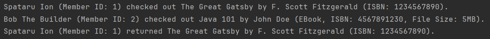
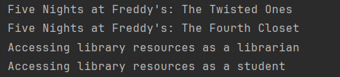

# FAF-TMPS

---

## Table of Contents

- [Lab 0](#lab-0)
- [Lab 1](#lab-1)

---

## Lab 0


### Objectives

* Implement 2 SOLID letters in a simple project.

---

### Implementation

For this laboratory I decided to write code that implements the first
two letters from the SOLID Principle: Single Responsibility Principle and Open/Closed Principle.
We have a class for Book and a class for Member that a single responsibility, that being managing their required data.
```
public class Book {
    private final String title;
    private final String author;
    private final String isbn;

    public Book(String title, String author, String isbn) {
        this.title = title;
        this.author = author;
        this.isbn = isbn;
    }
}
```

```
public class Member {
    private final String name;
    private final String surname;
    private final int id;

    public Member(String name, String surname, int id) {
        this.name = name;
        this.surname = surname;
        this.id = id;
    }
}
```
The Library class uses OCP in the way of making it open for extension by being able to add new book types like EBook 
without changing any existing code inside the class, making it closed for modification.
```
public class Library {
    private List<Book> books;
    private List<Member> members;
    private Map<Book, Member> checkedOutBooks;

    public Library() {
        books = new ArrayList<>();
        members = new ArrayList<>();
        checkedOutBooks = new HashMap<>();
    }
}
```
Here is the EBook class:
```
public class EBook extends Book {

    private final int fileSize;
    public EBook(String title, String author, String isbn, int fileSize) {
        super(title, author, isbn);
        this.fileSize = fileSize;
    }
}
```
I then use Main class to implement some code that makes use of these classes and principles:
```
public class Main {
    public static void main(String[] args) {
        Book book1 = new Book("Lord of the Rings", "J. R. R. Tolkien", "1345823484530");
        Book book2 = new Book("Five Nights at Freddy's: The Silver Eyes", "Scott Cawthon", "5243693821246");
        EBook ebook = new EBook("Java 101", "Monty Jarvis", "1453426043353", 5);

        Member member1 = new Member("Spataru", "Ion", 1);
        Member member2 = new Member("Bob", "The Builder", 2);

        Library library = new Library();
        library.addBook(book1);
        library.addBook(book2);
        library.addBook(ebook);

        library.addMember(member1);
        library.addMember(member2);

        library.checkoutBook(member1, book1);
        library.checkoutBook(member2, ebook);
        library.returnBook(book1);
    }
}
```

---

### Result


---

### Conclusion
In conclusion, by using 2 letters from the SOLID principle, Single Responsibility Principle(SRP) and Open/Closed Principle(OCP),
it has been shown that it makes the code more clean and flexible, making it readable for everyone and easier to implement new content.
By printing out the result, we can see that even without changing the Library class, by adding the EBook class to
the Book category we added new functionality to it.

__________________________________
-

## Lab 1

### Objectives
* Study the Creational Design Patterns.
* Choose a specific domain, define its main classes/models/entities and choose the appropriate instantiation mechanisms.
* Implement 3 Creational DPs for the specific domain.

---

### Used Design patterns:
* Factory
* Prototype
* Singleton

---

### Implementation

My project example follows the laboratory zero classes and implements them in a way to fit the above mentioned 
design patterns. I use Factory design pattern for creating a member at a library. I have MemberFactory class, which
serves as a factory for creating different types of members. The Member interface is implemented by two classes: 
Student and Librarian. Each of these classes provides a specific implementation of the method which allows you to access
library resources.
```
public class MemberFactory {
    public static Member createMember(String memberType) {
        return switch (memberType.toLowerCase()) {
            case "librarian" -> new Librarian();
            case "student" -> new Student();
            default -> throw new IllegalArgumentException("No such member type!");
        };
    }
}
```
Next up we have Singleton design pattern. For this design pattern I used the Library class, because there is only one
library needed to coordinate all of the actions inside of it, in my case the library instance is responsible for managing
books. To avoid creating a Library instance using a normal constructor, I made the default constructor private so that it
would only be created or retrieved if exists by only using the getInstance() static method.
```
public class Library {

    private static Library instance;

    private List<Book> books = new ArrayList<>();

    private Library () {}

    public static Library getInstance() {
        if (instance == null) {
            instance = new Library();
        }
        return instance;
    }

    public void addBook(Book book) {
        books.add(book);
    }

    public void getBooks() {
        System.out.println("List of available books:");
        this.books.forEach(book -> System.out.println(book.getTitle()));
    }
}
```
For the final used design pattern we have the Protoype design pattern. I implemented the Prototype Design Pattern to 
allow books to be duplicated (cloned) easily, so that in case of having the same author or genre it is much faster to 
create a new instance.
```
public class Book implements Prototype {

    private String title;
    private String author;
    private String isbn;
    private String genre;

    @Override
    public Book clone() {
        return new Book(this.title, this.author, this.isbn, this.genre);
    }
}

```
And all of these design pattern are used in an example in my LibrarySystem class.
```
public class LibrarySystem {
    public static void main(String[] args) {
        Library library = Library.getInstance();

        Book prototypeBook = new Book("Five Nights at Freddy's: The Silver Eyes", "Scott Cawthon", "5243693821246", "horror");

        Book book1 = prototypeBook.clone();
        book1.setTitle("Five Nights at Freddy's: The Twisted Ones");
        book1.setIsbn("7854303241543");
        library.addBook(book1);

        Book book2 = prototypeBook.clone();
        book2.setTitle("Five Nights at Freddy's: The Fourth Closet");
        book2.setIsbn("8645490254672");
        library.addBook(book2);

        library.getBooks();

        Member librarian = MemberFactory.createMember("librarian");
        librarian.accessLibraryResources();

        Member student = MemberFactory.createMember("student");
        student.accessLibraryResources();

    }
}
```
---

### Result



---

### Conclusion

During this laboratory, I explored three creational design patterns: Factory, Singleton, and Prototype patterns, each 
offering distinct advantages for object instantiation and management. 

In conclusion, by using these creational patterns, I was able
to enhance the flexibility, maintainability, and overall efficiency of my library project example. Each pattern
contributed uniquely to the structure of my project, allowing for clearer, more adaptable code that can readily 
accommodate future changes.