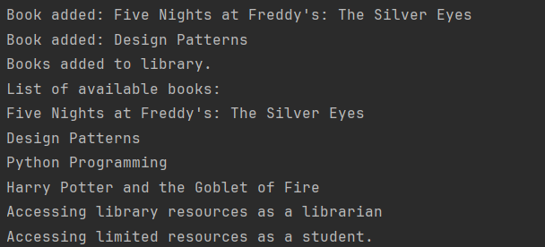

## Lab 3

### Author: Mihalachi Mihail

### Objectives
1. Study and understand the Behavioral Design Patterns.

2. As a continuation of the previous laboratory work, think about the functionalities that your system will need to provide to the user.

3. Implement some additional functionalities using behavioral design patterns.

---

### Theory
Behavioral design patterns are concerned with algorithms and the assignment of responsibilities between objects.
These patterns help manage object collaboration and communication, enabling systems to remain flexible and scalable.
They focus on how objects interact and the flow of information within a program.

### Key Objectives:
* Simplify object collaboration: Define clear communication protocols between objects while avoiding tight coupling.
* Encapsulate behavior: Enable flexibility by separating algorithms or responsibilities from the objects that use them.
* Promote scalability: Allow the system to evolve and add features without disrupting existing functionality.

### Common Behavioral Patterns:
* Chain of Responsibility Pattern:
Passes a request along a chain of handlers, where each handler decides whether to process the request or pass it to the next.

* Command Pattern:
Encapsulates a request as an object, allowing you to parameterize, queue, and log operations.

* Interpreter Pattern:
Provides a way to evaluate sentences in a language by defining a grammar and implementing an interpreter for it.

* Iterator Pattern:
Provides a way to access elements of a collection sequentially without exposing its internal structure.

* Mediator Pattern:
Centralizes complex communication between objects by introducing a mediator that manages interactions.

* Memento Pattern:
Captures an object's state to allow restoring it later, without exposing its internal details.

* Observer Pattern:
Establishes a one-to-many dependency between objects so that when one object changes state, its dependents are notified.

* State Pattern:
Allows an object to alter its behavior when its internal state changes, effectively changing its class.

* Strategy Pattern:
Defines a family of interchangeable algorithms and lets the client choose which one to use at runtime.

* Template Pattern:
Defines the skeleton of an algorithm in a base class, with steps that can be customized by subclasses.

---

### Used Design patterns:
* Iterator

---

### Implementation

My project example follows the library system built in laboratories 1 and 2. For this laboratory I added the Iterator 
Design Pattern for displaying the books inside the library. Previously I used the forEach() method pre-build in Java Streams,
now i've changed it to be able to display the books using an iterator. for starters I created an interface for Iterator, 
having the two required methods to iterate: hasNext() and next():
```
package lab_three.domain.iterator;

public interface Iterator {
    boolean hasNext();
    Book next();
}
```
Next up I created the Container interface. It is used to create the Iterator that we will later use to iterate through the book list:
```
package lab_three.domain.iterator;

public interface Container {
    Iterator getIterator();
}
```
After this I created a private BookIterator class inside my Library class so that I can use the mentioned functions from Iterator.
the hasNext() function checks if it hasn't reached the end of the array yet and next() gets you the book then moves to the next one.
Also the Library class implements the Container interface and creates the BookIterator class when getIterator() is called:
```
package lab_three.domain.models;

public class Library implements Container {

    public List<Book> books = new ArrayList<>();

    @Override
    public Iterator getIterator() {
        return new BooksIterate();
    }

    private class BooksIterate implements Iterator {
        int position = 0;

        @Override
        public boolean hasNext() {
            if (position < books.size()) {
                return true;
            }
            return false;
        }

        @Override
        public Book next() {
            return books.get(position++);
        }
    }
}
```
Finally, I use the iterator inside the LibraryFacade that I created in the previous laboratory.
In there we have a function to display all the books inside the library. We use a *for* statement to iterate through each 
available book, having as parameters our BooksIterator and its hasNext() function. It uses the position variable 
inside of the BooksIterator class as our usual "*int i = 0*", and hasNext() acts as "*i < length*", the "*i++*" part is 
present in the function next() that we use to get the books one by one:
```
package lab_three.domain.facade;

public class LibraryFacade {

    public void displayBooksInLibrary() {
        System.out.println("List of available books:");
        for(Iterator iter = library.getIterator(); iter.hasNext();){
            System.out.println(iter.next().getTitle());
        }
    }
}
```
And all of these design pattern are used in an example in my LibrarySystem class.
```
package lab_three.client;

public class LibrarySystem {
    public static void main(String[] args) {
        Book prototypePhysicalBook = new PhysicalBook("Five Nights at Freddy's: The Silver Eyes", "Scott Cawthon", "5243693821246", "horror", 274);
        Book eBook1 = new EBook("Design Patterns", "Erich Gamma", "9876547564456", "Technology", "5 MB");

        List<Book> bookList = new ArrayList<>();
        Book book2 = prototypePhysicalBook.clone();
        book2.setTitle("Five Nights at Freddy's: The Twisted Ones");
        book2.setIsbn("7854303241543");
        bookList.add(new PhysicalBook("Python Programming", "Jane Doe", "654321", "Technology", 192));
        bookList.add(new EBook("Harry Potter and the Goblet of Fire", "J. K. Rowling", "4567894025677", "Technology", "8 MB"));

        LibraryFacade libraryFacade = new LibraryFacade();

        libraryFacade.addBookToLibrary(prototypePhysicalBook);
        libraryFacade.addBookToLibrary(eBook1);
        libraryFacade.addBooksToLibrary(bookList);

        libraryFacade.displayBooksInLibrary();

        Member librarian = new MemberProxy("librarian");
        librarian.accessLibraryResources();

        Member student = new MemberProxy("student");
        student.accessLibraryResources();
    }
}
```
---

### Result



---

### Conclusion

During this laboratory, I explored one behavioral design pattern: Iterator pattern, used to display all the books from the library.

In conclusion, by using this behavioral pattern, I was able
to enhance the usability, maintainability, and overall efficiency of my library project example. By decoupling iteration 
logic from the underlying data structure, it enhances code flexibility and reusability, making it easier to extend and maintain.