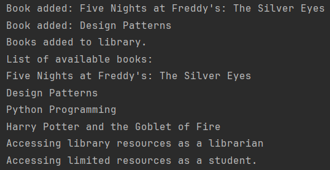

## Lab 2

### Author: Mihalachi Mihail

### Objectives
1. Study and understand the Structural Design Patterns.

2. As a continuation of the previous laboratory work, think about the functionalities that your system will need to provide to the user.

3. Implement some additional functionalities using structural design patterns.

---

### Theory
Structural design patterns are patterns that deal with the composition of classes or objects to form larger structures. 
These patterns help ensure that the system's components are organized and interact efficiently while promoting flexibility
and reusability. They focus on how to combine various objects or classes to create larger, more complex systems.

Key Objectives:
* Simplify relationships: They aim to simplify complex structures by creating clear hierarchies or relationships between components.
* Promote flexibility and reusability: Structural patterns enable flexible design by making it easier to add or change 
functionality without disrupting the entire system.

Common Structural Patterns:
* Adapter Pattern: Converts one interface to another expected by the client, allowing incompatible interfaces to work together.
* Bridge Pattern: Decouples an abstraction from its implementation, allowing the two to vary independently.
* Composite Pattern: Treats individual objects and compositions of objects uniformly, often used for representing tree-like structures.
* Decorator Pattern: Adds new functionality to an object dynamically without altering its structure.
* Facade Pattern: Provides a simplified interface to a complex subsystem, making it easier to interact with.
* Flyweight Pattern: Reduces memory usage by sharing common data between objects, especially when many objects have similar data. 
* Proxy Pattern: Controls access to an object, allowing for actions like lazy loading, access control, or logging.

---

### Used Design patterns:
* Proxy
* Composite
* Facade

---

### Implementation

My project example follows the laboratory one classes and implements them in a way to fit the above mentioned
design patterns. I use Proxy design pattern for creating a better member system.  
In my implementation I have MemberProxy class, which creates limits depending on the type of member. The MemberProxy class 
is implemented by using the previously built Member interface and a memberType attribute which can be one of the two classes: 
Student or Librarian. Each of these classes provides has a specific access priority for the library resources, 
the Librarian having access to all of the resources while the Student has a limited access. Here is the class implementation:
```
package lab_two.domain.factories;

public class MemberProxy implements Member {
    private final Member member;
    private final String memberType;

    public MemberProxy(String memberType) {
        this.memberType = memberType.toLowerCase();

        this.member = switch (this.memberType) {
            case "librarian" -> new Librarian();
            case "student" -> new Student();
            default -> throw new IllegalArgumentException("No such member type!");
        };
    }

    @Override
    public void accessLibraryResources() {
        if (memberType.equals("librarian")) {
            member.accessLibraryResources();
        } else if (memberType.equals("student")) {
            System.out.println("Accessing limited resources as a student.");
        } else {
            System.out.println("Access denied. Invalid member type.");
        }
    }
}
```
Next up we have Facade design pattern. Provides a simplified, unified interface to a complex subsystem or set of interfaces. 
It hides the complexities of the subsystem and makes it easier to use. I implemented it in my Library class, because the
client accesses the library to get all the actions inside of it, in my case adding and getting books from my library. 
What makes it easier in LibraryFacade than in Library is that you can add one or multiple books in the library and also
display the books in a better format.
```
package lab_two.domain.facade;

public class LibraryFacade {

    private final Library library;

    public LibraryFacade() {
        library = Library.getInstance();
    }

    public void addBookToLibrary(Book book) {
        library.addBook(book);
        System.out.println("Book added: " + book.getTitle());
    }

    public void addBooksToLibrary(List<Book> books) {
        library.addBooks(books);
        System.out.println("Books added to library.");
    }

    public void displayBooksInLibrary() {
        List<Book> books = library.getBooks();
        if (books.isEmpty()) {
            System.out.println("No books available in the library.");
        } else {
            System.out.println("List of available books:");
            books.forEach(book -> System.out.println(book.getTitle()));
        }
    }
}
```
For the final used design pattern we have the Composite design pattern. The pattern allows you to compose objects into 
tree-like structures to represent part-whole hierarchies, where individual objects and groups of objects can be treated the same.
I implemented this design pattern to allow different kinds of books to be added inside the Library, in my case a regular (physical) book
and an EBook. I created a main abstract class Book which serves as the parent for both type of books, then implemented the class
in both PhysicalBook and EBook. The Composite also needs a Collection class to display all types of Books. Luckily, my 
Library class already stores my books in there, so I just used this class to further implement the Composite Design pattern.

```
package lab_two.domain.book;

public abstract class Book implements Prototype {
    private String title;
    private String author;
    private String isbn;
    private String genre;

    public Book(String title, String author, String isbn, String genre) {
        this.title = title;
        this.author = author;
        this.isbn = isbn;
        this.genre = genre;
    }

    @Override
    public abstract Book clone();

    public abstract String getDetails();
}
```
```
package lab_two.domain.models;

public class PhysicalBook extends Book {
    private int pages;

    public PhysicalBook(String title, String author, String isbn, String genre, int pages) {
        super(title, author, isbn, genre);
        this.pages = pages;
    }

    @Override
    public PhysicalBook clone() {
        return new PhysicalBook(this.getTitle(), this.getAuthor(), this.getIsbn(), this.getGenre(), this.pages);
    }

    @Override
    public String getDetails() {
        return "Physical Book - Nr of pages: " + pages;
    }
}
```
```
package lab_two.domain.models;

public class EBook extends Book {
    private final String memory;

    public EBook(String title, String author, String isbn, String genre, String fileFormat) {
        super(title, author, isbn, genre);
        this.memory = fileFormat;
    }

    @Override
    public EBook clone() {
        return new EBook(this.getTitle(), this.getAuthor(), this.getIsbn(), this.getGenre(), this.memory);
    }

    @Override
    public String getDetails() {
        return "EBook - Storage Space: " + memory;
    }
}
```
And all of these design pattern are used in an example in my LibrarySystem class.
```
package lab_two.client;

public class LibrarySystem {
    public static void main(String[] args) {
        Book prototypePhysicalBook = new PhysicalBook("Five Nights at Freddy's: The Silver Eyes", "Scott Cawthon", "5243693821246", "horror", 274);
        Book eBook1 = new EBook("Design Patterns", "Erich Gamma", "9876547564456", "Technology", "5 MB");

        List<Book> bookList = new ArrayList<>();
        Book book2 = prototypePhysicalBook.clone();
        book2.setTitle("Five Nights at Freddy's: The Twisted Ones");
        book2.setIsbn("7854303241543");
        bookList.add(new PhysicalBook("Python Programming", "Jane Doe", "654321", "Technology", 192));
        bookList.add(new EBook("Harry Potter and the Goblet of Fire", "J. K. Rowling", "4567894025677", "Technology", "8 MB"));

        LibraryFacade libraryFacade = new LibraryFacade();

        libraryFacade.addBookToLibrary(prototypePhysicalBook);
        libraryFacade.addBookToLibrary(eBook1);
        libraryFacade.addBooksToLibrary(bookList);

        libraryFacade.displayBooksInLibrary();

        Member librarian = new MemberProxy("librarian");
        librarian.accessLibraryResources();

        Member student = new MemberProxy("student");
        student.accessLibraryResources();
    }
}
```
---

### Result



---

### Conclusion

During this laboratory, I explored three structural design patterns: Proxy, Composite, and Facade patterns, each
offering distinct advantages for object instantiation and management.

In conclusion, by using these structural patterns, I was able
to enhance the usability, maintainability, and overall efficiency of my library project example. Each pattern
contributed uniquely to the structure of my project, allowing for a better user interaction and a better structured code
that can readily accommodate future changes.